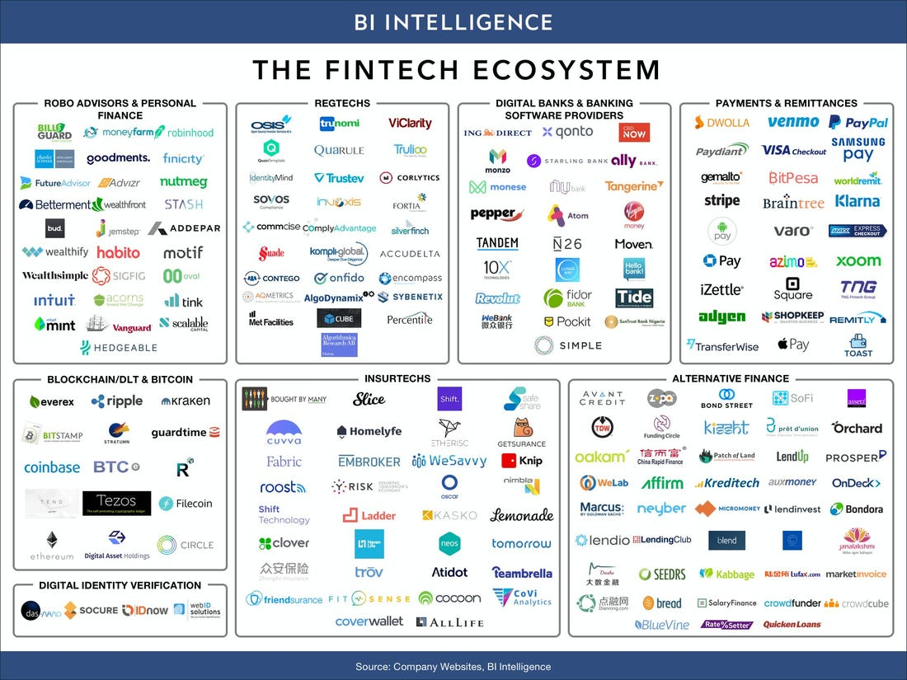

# Stripe Case Study
A case study on Stripe, a FinTech company that enable individuals and businesses to make and receive payments over the Internet. Its software platform lets businesses accept online payments, with customers ranging from small websites to Amazon and Facebook. In 2019, Stripe launched a new corporate credit card and small business loans, which are automatically repaid from payments it processes for borrowers.

## History
Irish entrepreneur brothers John and Patrick Collison founded Stripe in 2010, initially using the name /dev/payments. Stripe was founded in Palo Alto, but moved to San Francisco in 2012. As of 2019, Stripe was operating across four engineering hubs in Seattle, Dublin, San Francisco and Singapore. 

Funding history:

* In June 2010, Stripe received seed funding from Y Combinator, a start-up accelerator. 
* In May 2011, Stripe received a $2 million investment from venture capitalists Peter Thiel, Sequoia Capital, and Andreessen Horowitz. In February 2012, Stripe received an $18 million Series A investment, led by Sequoia Capital at a $100 million valuation. Stripe launched publicly in September 2011 after an extensive private beta. Less than a year after its public launch, Stripe received a $20 million Series B investment. In March 2013, Stripe acquired chat and task-management application Kick-off.

* In 2016, Stripe was valued at over $9 billion when it raised a $150 million round. In its next funding round in September 2018, Stripe received a $20 billion valuation while raising $245 million.

* In 2019, Stripe raised an additional $100 million in a Series E round from investment firm Tiger Global Management, boosting the payment startup's valuation to $22.5 billion.

* In September 2019, Stripe raised $250 million in a new funding round to take its enterprise value to $35 billion. In February 2020 Manhattan Venture Research in New York referred to Stripe as “ripe for an initial public offering (IPO)".

## Product and Services

Stripe provides the technical, fraud prevention, and banking infrastructure required to operate online payment systems. As summarized by the San Francisco Chronicle in 2019, Stripe succeeded by distilling the complex, creaking infrastructure of online payments into a handful of lines of code that could be inserted into a client’s website."

### Payment logistics
Stripe provides APIs that web developers can use to integrate payment processing into their websites and mobile applications. In April 2018, the company released anti-fraud tools that run alongside payment APIs to block fraudulent transactions.

In 2018, the company expanded its services to include a billing product for online businesses. The service operates within the Stripe platform, allowing businesses to manage subscription recurring revenue and invoicing.

### Atlas
The Atlas platform allows companies from the Gaza Strip to Berwick-upon-Tweed to incorporate as a US company in Delaware – a state with such business-friendly courts, tax system, laws and policies that 60 per cent of Fortune 500 companies including the Bank of America, Google and Coca-Cola are incorporated there for just $500.

On February 24, 2016, the company launched the Atlas platform that allows startups to incorporate more easily in the U.S. The platform originally launched as invite-only. In March 2016, Cuba was added to the list of countries covered under the program. Atlas was relaunched with improvements the following year. 

### Issuing
In July 2018, Stripe began a platform for companies to issue Mastercard and Visa credit cards.

### Terminal
On September 17, 2018, Stripe announced a new point of sale solution called Terminal, initially launched as an invite-only beta. The service offers physical credit card readers designed to work with Stripe. Stripe currently works with two card readers: Verifone P400 and BBPOS Chipper 2X BT. Terminal also includes detailed documentation along with SDKs for iOS, Javascript, and Android. On June 11, 2019, Stripe made Terminal available to all U.S. users, ending the product’s beta testing phase.

### Sorbet
In June 2019, Stripe launched Sorbet, an open source type checker for Ruby.

### CLI
On November 5, 2019, Stripe announced the launch of the Stripe command-line interface (CLI). Stripe's CLI is a way to interact with Stripe from the terminal and makes it easier to build, test, and manage integrations.

## Fintech Landscape

## Results

Stripe's product making it easy for developers to accept credit cards on the web. Stripe signed deals with Lyft, Facebook, DoorDash, Deliveroo, Seedrs, Monzo, The Guardian, Boohoo, Salesforce, Shopify, Indiegogo, Asos and TaskRabbit. The company won’t disclose its payments volume but says it processes billions of dollars a year for millions of companies.
Over the past year, 80 per cent of US users have bought something from a Stripe-powered business, although very few of them knew they were using it.

Atlas had signed more than 200 international startups in 2017. As of March 2019, startups from 120 countries have used Stripe Atlas to start their business. Now startups can even be registered in Delaware.

 Stripe offers a simple and straightforward pricing scheme. It has no setup or monthly fees. Instead, you only pay when you use the service. The pricing rate is simply 2.9% + 30¢ per successful charge for credit and debit cards. This pricing is a lot simpler than its competitor Adyen. Ayden offers no fixed enterprise pricing plans, but charges a calculated processing fee and commission per each transaction - which depend foremost on the payment method you’ve selected. 

## Recommendations
My recommendation is for Stripe to build from the strength of its technology, treasury expertise, network, and scale to build a strong retail brand by offering the following:

* Free account and debit cards

    Open an account from your phone in minutes, without a credit check. Just add a $20 deposit to get started and order your free card to spend at home or abroad in 150+ currencies.

* Hold, exchange and receive 20 CURRENCIES
    
    Whether you’re living abroad or have family overseas, you can hold, exchange, send and receive 20 currencies like USD, GBP, MXN, SGD, CAD and EUR in seconds.

*  Spend and transfer with the interbank exchange rate

    Banks usually charge rip-off fees when you spend or transfer money abroad. We don’t. With this service, you can spend and transfer money abroad with the interbank exchange rate.

